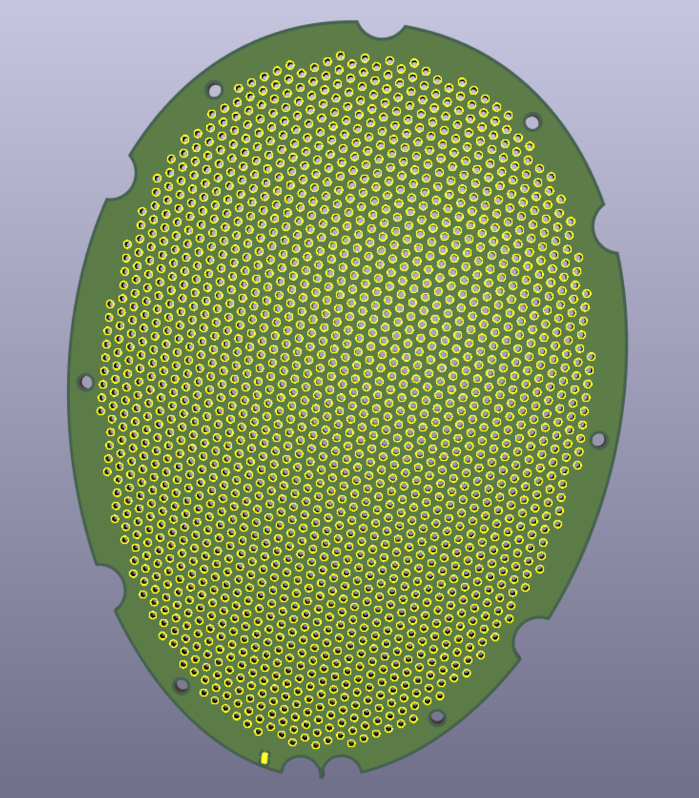
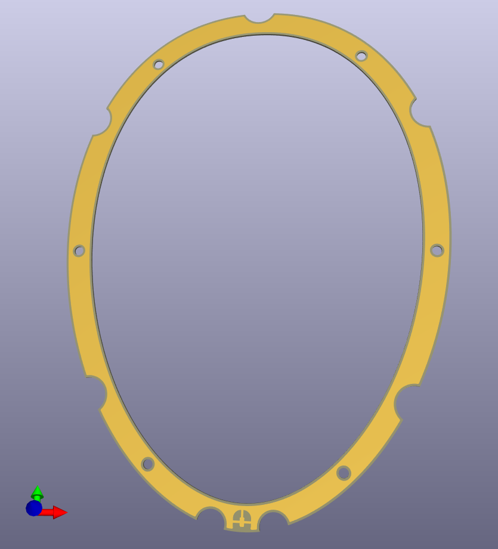

# Open-ESL — DIY Electrostatic Headphones

[](https://www.gnu.org/licenses/old-licenses/gpl-2.0.en.html)
[](https://github.com/dakata1337/open-esl)

---

## H1 — Latest Revision (WIP)

**H1** is the most recent design — a major upgrade over the Jade II clone.

### Key Improvements
| Feature                          | H1 (New)                          | Jade II Clone                  |
|----------------------------------|-----------------------------------|--------------------------------|
| Connector                        | Detachable mini-XLR               | Hard-wired                     |
| Earpad mounting                  | Tool-less, secure clip system     | Basic adhesive/glue            |
| Transducer-to-earcup mount       | Press fitted by earpad clip       | Fixed screws                   |
| Rear grill                       | Integrated + option for a SS mesh | None                           |
| Overall serviceability           | Highly modular                    | Low                            |

### Project Structure
```
h1/
├── h1.FCStd                  ← Main FreeCAD 3D model (earcups, mounts, grill, everything)
├── *.dxf                     ← Stator & spacer outlines, screw holes, edge cuts (referces for PCB design)
├── generete-gerbers.sh       ← Script to batch-generate all Gerbers using kicad-cli
├── pcb-stator/
│   ├── pcb-stator.kicad_pro
│   ├── pcb-stator.kicad_sch
│   ├── pcb-stator.kicad_pcb
│   └── h1-pcb-stator-gerbers.zip
├── pcb-spacer/
│   ├── pcb-spacer.kicad_pro
│   ├── pcb-spacer.kicad_sch
│   ├── pcb-spacer.kicad_pcb
│   └── h1-pcb-spacer-gerbers.zip
└── media/                    ← Renders, assembly photos & exploded views
jade-ii/                      ← Legacy version
```
**Everything you need to manufacture H1 is inside the `h1/` folder.**

## Gallery

| 3D Printed assembly               | Stator                                      | Spacer                                      |
|-----------------------------------|---------------------------------------------|---------------------------------------------|
||  |  |
---

## How to Build H1
**⚠️ SAFETY NOTE ⚠️**  
`
Electrostatic headphones use high-voltage bias (>600V) & high voltage & current to drive the stators (>700V pk-pk, depends on the amplifier).
Only build if you understand high-voltage safety. Always disconnect the headphones from the amplifier before opening them!
`

### 1. Mechanical Parts (FreeCAD)
- Open `h1.FCStd` in **FreeCAD 1.0.0** or newer
- Export earcups, mounts, and grill as STL or STEP (TODO: releases with already generated files)
- 3D-print (recommended: PETG or ABS)

### 2. Stator & Spacer PCBs
- Use the provided KiCad projects **or** the ready-to-order Gerbers
- Run `./generete-gerbers.sh` if you want to regenerate
- Order 2 stators + 2 spacers per headphone (FR4 0.6 mm for the spacer & 1mm for the stators)

### 3. Diaphragm & Assembly
- Standard ESL workflow: 1-7 µm mylar + conductive coating;
- Spacer thickness sets the sensitivity of the headphone. For H1 We've used 0.6mm as it's thinnest PCB option offered by PCB manufactures at a reasonable price.


---

## Bill of Materials (BOM)

**Coming Soon** — a full spreadsheet with part numbers, JLCPCB/PCBWay links, and 3D-print settings will be added to `h1/`.

Until then, the KiCad & FreeCAD projects are exported inside the `h1/` folder.

---

## Deprecated design — Jade II Clone

Kept for reference only. H1 is the recommended design for all new builds.

---

## Contributing

H1 is still **WIP**. You can help by:
- Creating detailed step-by-step assembly instructions
- Improving the FreeCAD model (parametric earpad adapters, etc.)
- Anything you think needs improvements

Pull requests and issues are very welcome.

---

## License
**GPL-2.0** — you are free to build, modify, and even sell headphones made with these files, as long as you share your changes under the same license.
See [LICENSE](LICENSE) for details.

---

**Made with ❤️ for the DIY audio community**

[Open the H1 folder →](https://github.com/dakata1337/open-esl/tree/master/h1)
