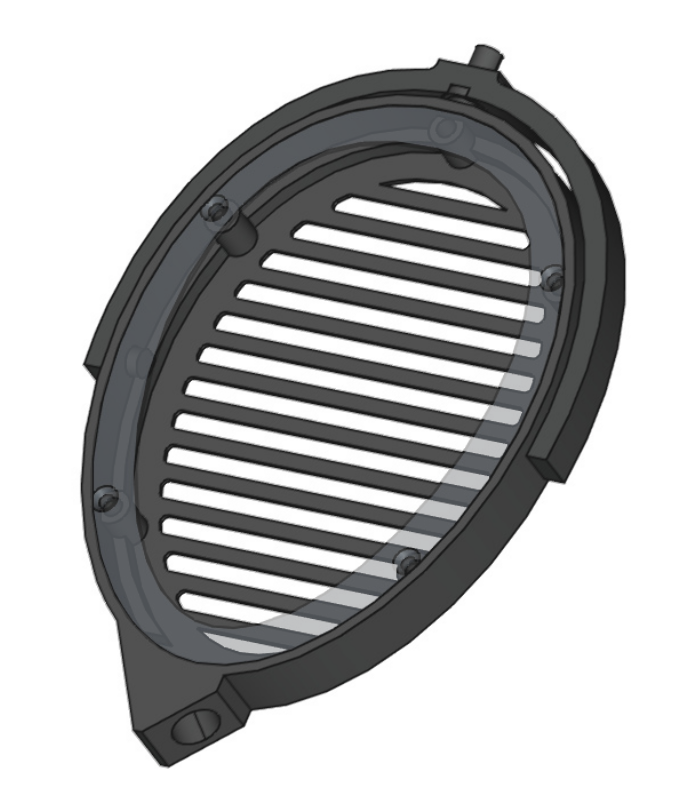
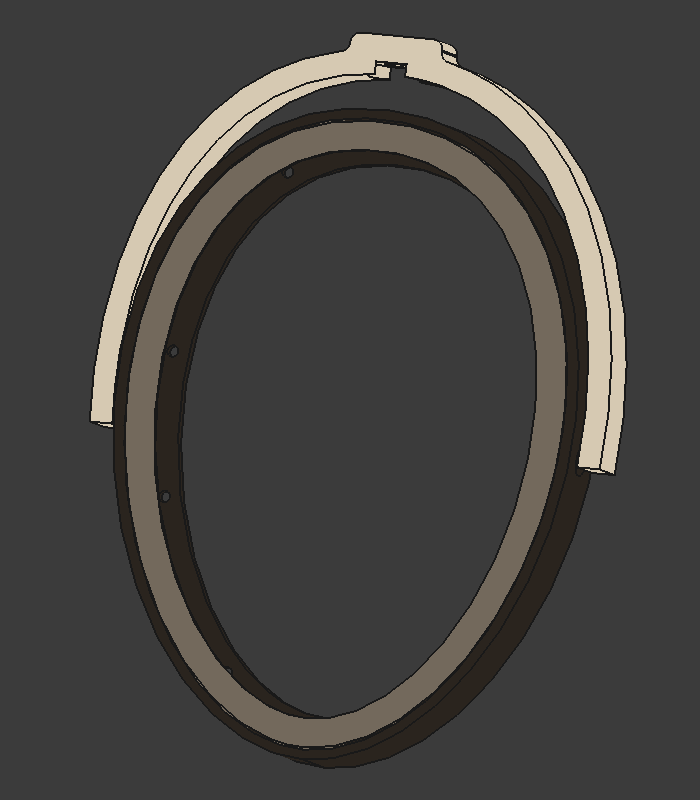
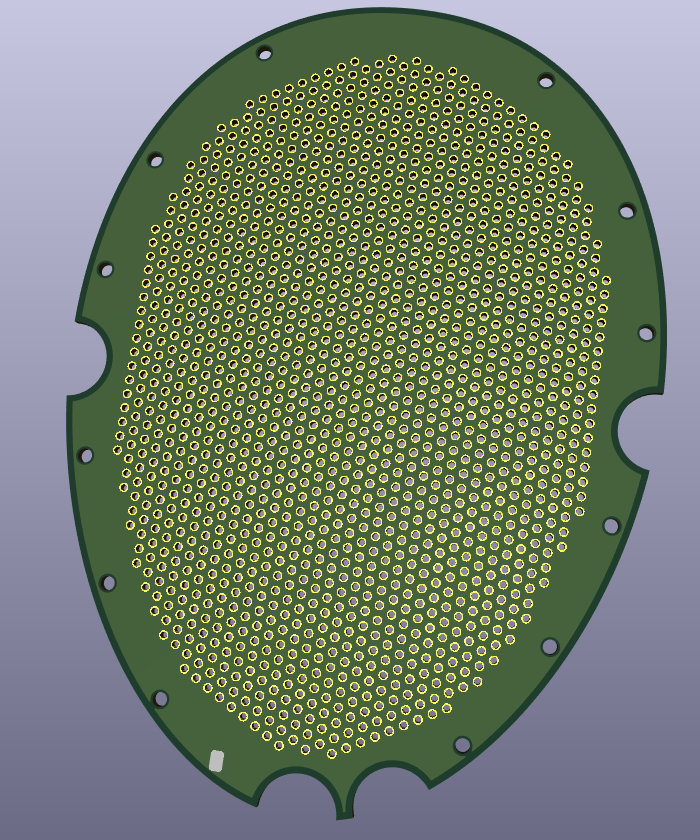

# open-esl
This project aims to create an entirely open source DIY electrostatic headphones.

## H1 (WIP)
H1 is an improved version of the Jade II Clone. Main improvements are:
- detachable mini xlr connectors
- better earpad mounting mechanism
- new mounting mechanism between transducer & earcup
- integrated grill on the back of the earcup (also possible to add a stainless steel mesh)

## Jade II Clone

