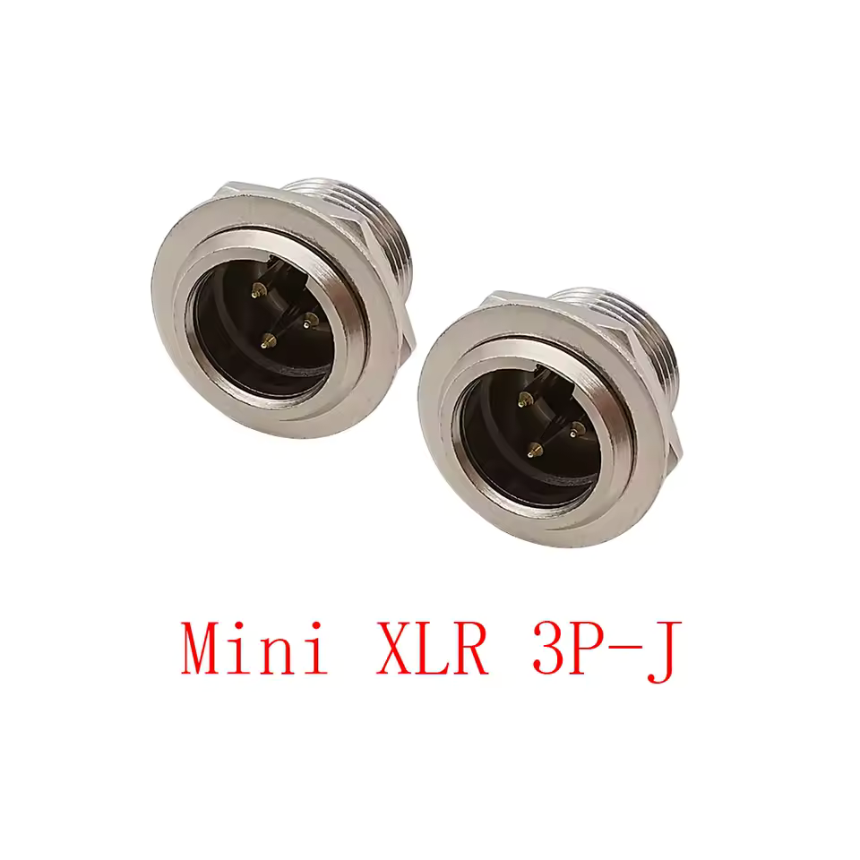
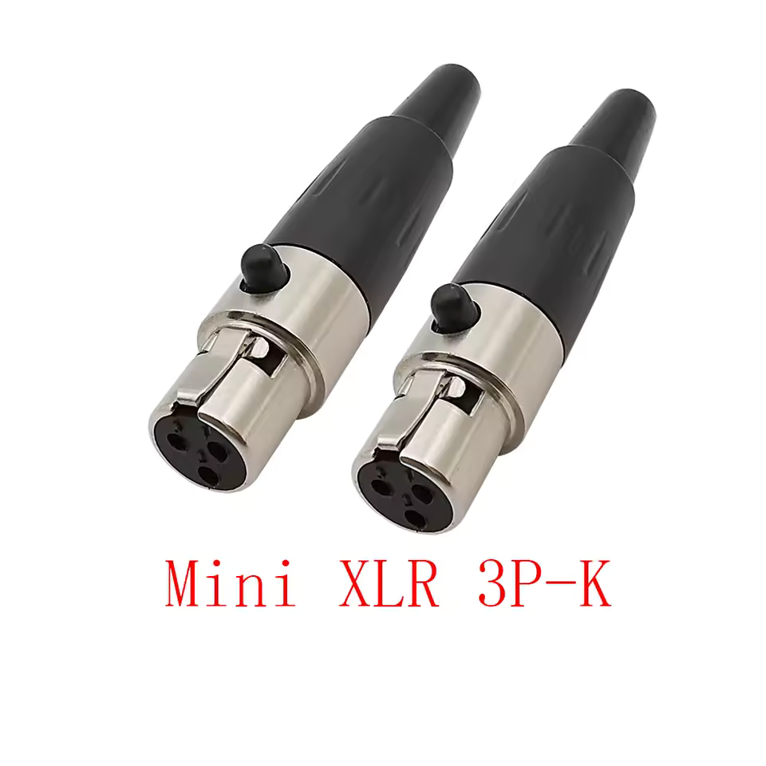
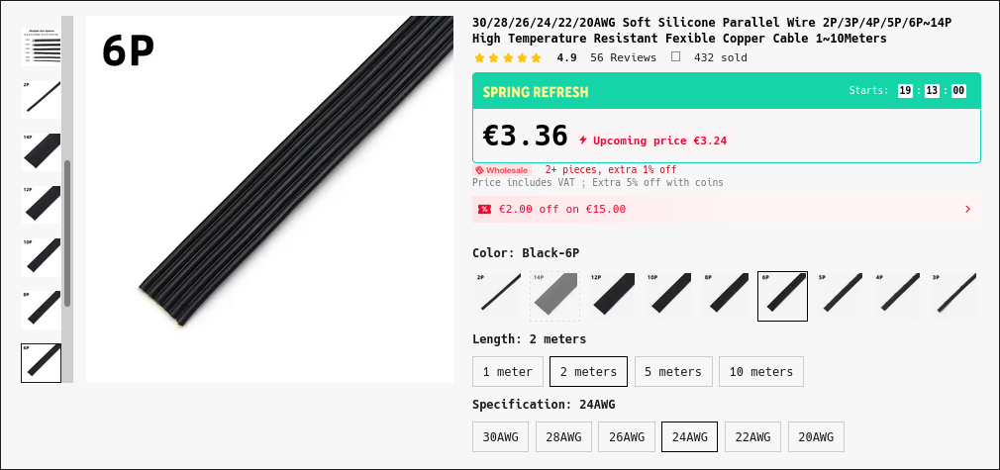
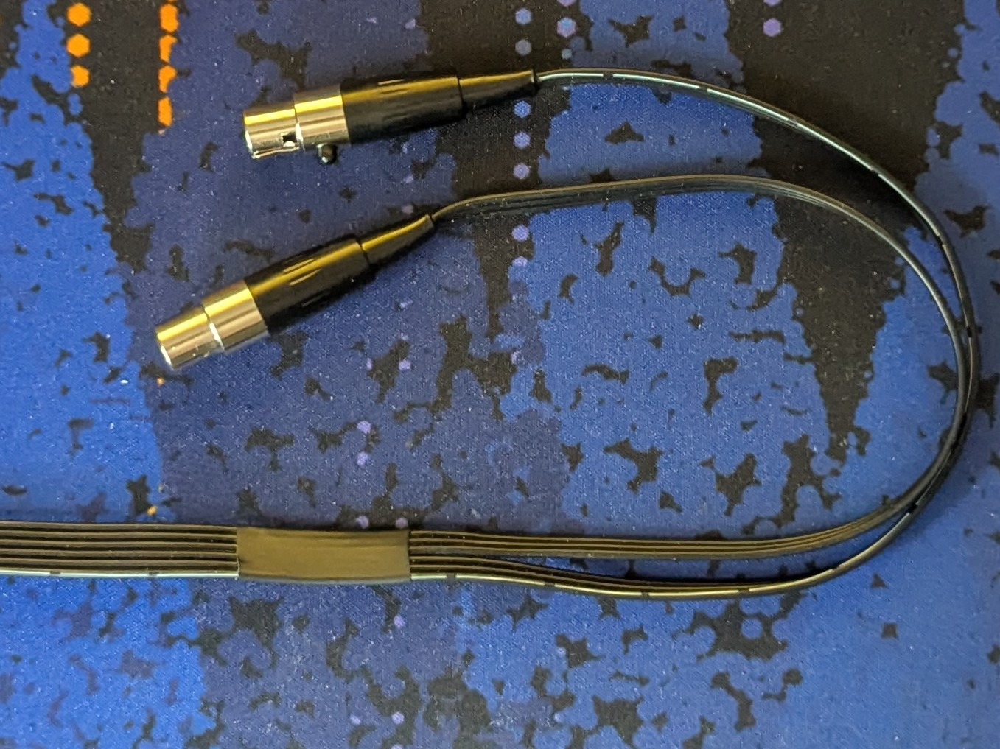
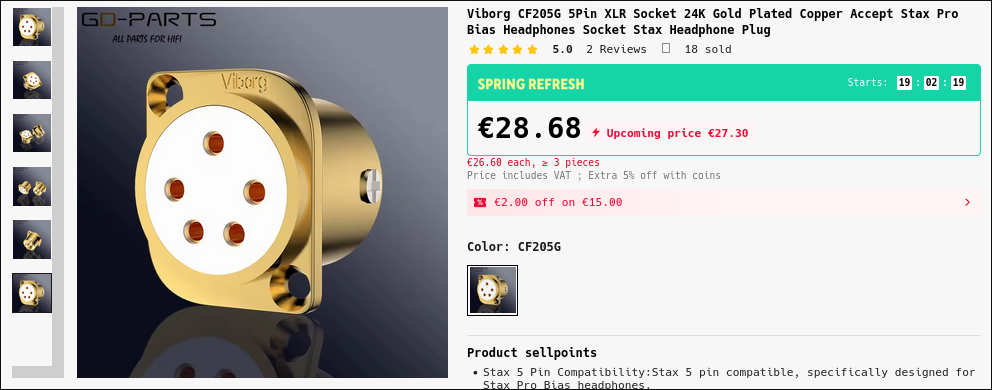
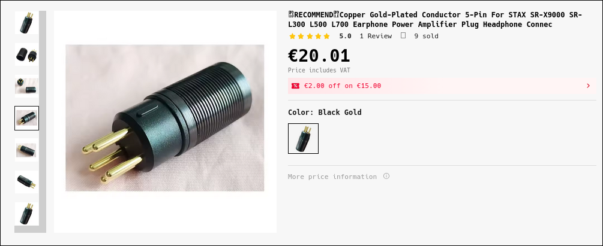

# BOM
This document specifies the required parts to make a single headphone. They are
split into two categories: [Parts to buy](#parts-to-buy) and [Parts to 3D print](#parts-to-3d-print)

## Parts to buy
### 3 pin Mini-XLR (2pcs)
These will be used screwed into the headphone earcups.
| Male socket for earcup          | Female connector (HV present!)     |
|---------------------------------|------------------------------------|
|||

<!-- TODO: Specify thread size -->

### 6 conductor cable (2m recommended)
The headphone actually needs just 5 conductor cable (L+ L- | R+ R- | Bias), but
because we've used a flat cable it's much easier to just run two different
conductors for Bias to each driver. This way we don't need to slice the cable
for the left/right split (a simple heatshrink does the trick nicely).
| 6 conductor cable               | The split for L/R channel          |
|---------------------------------|------------------------------------|
|     |  |

### Amplifier connector (1 connector + 1 plug)
Here we have two options:

#### A Stax compatible connector
These can be found on the second hand market or AliExpress.This will make the
headphone interchangable with all Stax amps, but at a higher cost of the
connector (almost 50€ at time of writing!).

| Stax Connector                  | Stax Plug                          |
|---------------------------------|------------------------------------|
| |         |

#### Generic 5 pin connectors (XLR or Lemo clones).
This is the cheaper alternative, but will require modification of the
amplifier. If you're also DIY-ing the amplifier this option is more reasonable.
5 Pin XLR ones are readily available and cheap, but bulky is comparison to the
Lemo clones. Another plus of the Lemo type of connectors/plugs is that they are
push-pull and don't have a push release like most XLR ones.

**IMPORTANT**: *If you go this route make sure the connector on the amplifier is Female,
because we don't want any exposed pins to the high voltage outputs of the amplifier!*

---

This is the end of [Parts to buy](#parts-to-buy) you can return to [top of BOM here](#bom).

---

## Parts to 3D print

---

This is the end of [Parts to 3D print](#parts-to-3d-print) you can return to [top of BOM here](#bom).

---
